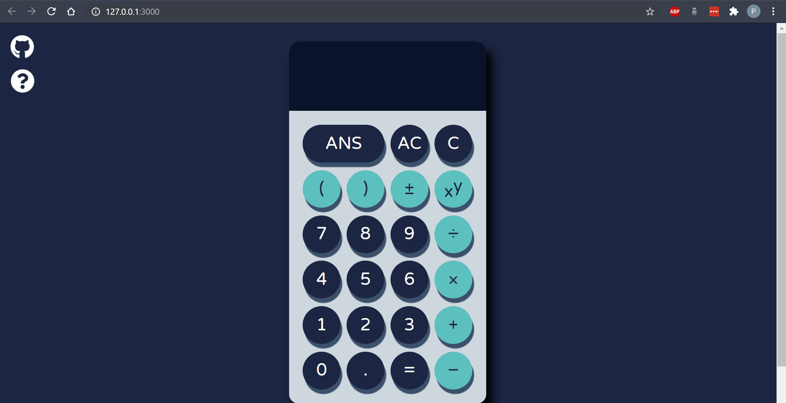

# Calculator

An online calculator with basic arithmetic features controlled by either the mouse or keyboard, built using HTML5, CSS3/SCSS, and JavaScript ES6. [__Visit the site__](https://pa-aggarwal.github.io/calculator/) and start doing your own calculations!



Recorded using [ScreenToGif](https://www.screentogif.com/).

## Features

* All operations supported (add, subtract, multiply, divide, exponents, brackets).
* Calculations performed using __order of operations__ or [BEDMAS](https://en.wikipedia.org/wiki/Order_of_operations#Mnemonics).
* Options to __clear__ the display, __undo__ last entry, and get the last calculation's result.
* Keyboard usage for entering options/numbers/operators.

See the keyboard shortcuts by clicking on the question mark in the page's top left corner.

## Launch

This project's main script uses `<script type="module">`, so a __local web-server__ is required for running this project locally. To learn more about this, see this [JS Modules Article](https://javascript.info/modules-intro).

A compiler is also needed for compiling \*.scss files into .css files.

### Server Installation

If you don't have a local server, your text-editor probably offers a live-server extension to do this, here are some packages to check out:
* Atom's [atom-live-server](https://atom.io/packages/atom-live-server)
* Visual Studio Code's [Live Server](https://marketplace.visualstudio.com/items?itemName=ritwickdey.LiveServer)

In case you're using a different text-editor, install [Node.js](https://nodejs.org/en/) by following [these instructions](https://www.npmjs.com/get-npm), in case you don't already have this installed.

After installing Node, run these commands in your terminal:

```
$ npm install -g live-server
```
This command installs this [live-server npm package](https://www.npmjs.com/package/live-server#installation) globally.

```
$ cd ../../path-to-repo
# Run package
$ live-server
```
Navigate to where this repo is on your machine and run the live-server package.

### SCSS Compiler Installation

Install [Node.js](https://nodejs.org/en/) by following the [instructions here](https://www.npmjs.com/get-npm). Then, run these commands in your terminal:

```
$ npm install -g node-sass
```
This command installs this [node-sass npm package](https://www.npmjs.com/package/node-sass) globally.

```
# 1.
$ cd ../../path-to-repo
# 2.
$ npm run scss
```

1. Navigate to where this repo is on your machine.
2. Run a script which watches .scss files for changes and then compiles those files into css files.

## Contributing

1. Clone/fork repository and create a new branch: `$ git checkout https://github.com/pa-aggarwal/calculator.git -b your-branch-name`
2. Make your changes
3. Submit a pull request and explain your changes.

## Acknowledgement

This project was inspired by [The Odin Project](https://www.theodinproject.com/home) online learning curriculum.

## License

* [MIT License](https://opensource.org/licenses/MIT)
* Copyright &copy; 2020 Priya Aggarwal
